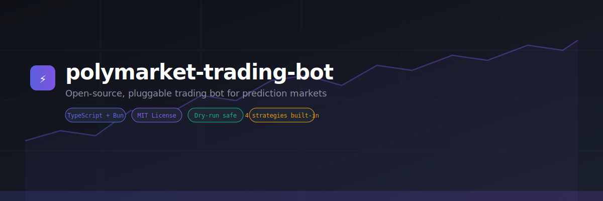
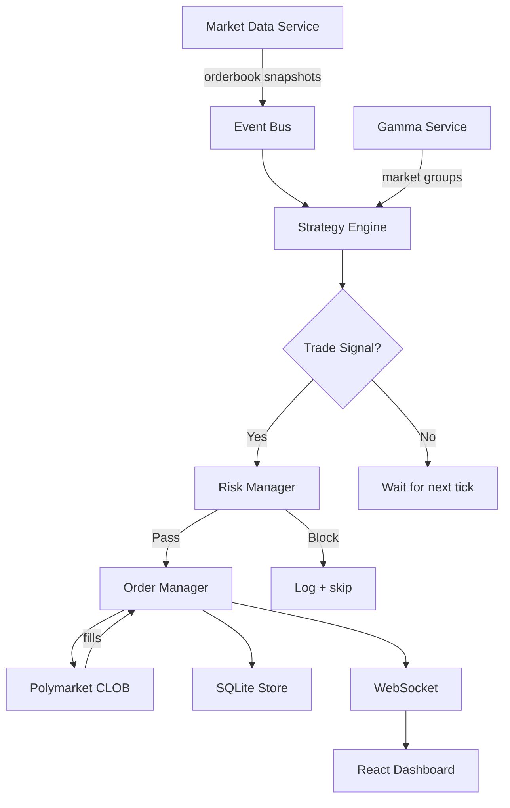

<div align="center">
  
</div>

<div align="center">

[](LICENSE)
[](https://www.typescriptlang.org/)
[](https://bun.sh/)
[](https://polymarket.com/)

**Pluggable, type-safe trading bot for Polymarket prediction markets.**  
Clone → configure → trade. Dry-run by default. Ship your own strategy in ~30 lines.

[Quick Start](#-quick-start) · [Strategies](#-strategies) · [Add a Strategy](#-add-a-strategy) · [Contributing](#-contributing)

</div>

---

## Why this exists

Polymarket has no official trading SDK. Rolling your own bot means wiring together: CLOB API auth, order lifecycle, risk controls, position tracking, and a live dashboard — all before you write a single line of strategy logic.

This repo does all of that for you. The only thing you write is an `evaluate()` function that returns a trade signal or `null`.

**What you get out of the box:**
- Real + mock CLOB client (dry-run with zero config)
- Event-driven engine with typed pub/sub
- Risk manager: position limits, exposure caps, daily loss halt
- SQLite persistence for orders and positions
- Live React dashboard over WebSocket
- 4 production strategies to learn from or fork

---

## Architecture



```
src/
  api/         → REST + WebSocket server for the dashboard
  bot/         → Bot engine (engine.ts) + factory wiring (factory.ts)
  client/      → Polymarket CLOB client (real + mock for dry-run)
  core/        → EventBus, Logger, SQLiteStore
  services/    → MarketData, OrderManager, RiskManager, GammaService
  strategies/  → Strategy implementations (extend BaseStrategy)
  types/       → Shared TypeScript types
  dashboard/   → React dashboard (served by the API server)
```

---

## Quick Start

**Requirements:** [Bun](https://bun.sh) ≥ 1.0

```bash
# 1. Clone
git clone https://github.com/jaredzwick/polymarket-trading-bot
cd polymarket-trading-bot

# 2. Install
bun install

# 3. Configure
cp .env.example .env
# DRY_RUN=true by default — no real money needed

# 4. Run
bun run dev
```

The bot starts in dry-run mode. Open `http://localhost:3000` for the live dashboard.

**To trade for real**, set your keys in `.env`:
```bash
DRY_RUN=false
PRIVATE_KEY=your_wallet_private_key
POLYMARKET_API_KEY=your_api_key
POLYMARKET_API_SECRET=your_api_secret
POLYMARKET_API_PASSPHRASE=your_passphrase
STRATEGIES=market-maker
TOKEN_IDS=<comma-separated token IDs>
```

---

## Strategies

| Strategy | Description | Signals on |
|---|---|---|
| `market-maker` | Places limit orders on both sides of the book to capture spread | Inventory skew + spread |
| `momentum` | Follows price trends over a rolling window | Directional momentum threshold |
| `mean-reversion` | Trades against extreme price moves via z-score | Z-score of rolling mean/stddev |
| `bregman-arb` | Cross-market arbitrage using Bregman divergence across correlated markets | Gamma API market groups |

Run multiple strategies at once:
```bash
STRATEGIES=market-maker,momentum bun run start
```

---

## Add a Strategy

A new strategy is ~30 lines. Create `src/strategies/my-strategy.ts`:

```typescript
import { BaseStrategy, type StrategyContext } from "./base";
import type { TradeSignal, OrderBook } from "../types";

export class MyStrategy extends BaseStrategy {
  readonly name = "my-strategy";

  constructor(ctx: StrategyContext) {
    super(ctx);
  }

  evaluate(tokenId: string, orderBook: OrderBook): TradeSignal | null {
    if (!this._enabled) return null;

    const { midPrice, spread } = orderBook;

    // Return null to skip. Return a signal to trade.
    if (spread < 0.02) return null;

    return {
      tokenId,
      side: "BUY",
      confidence: 0.7, // must be > 0.5 to execute
      targetPrice: midPrice,
      size: 10,
      reason: "spread exceeded threshold",
    };
  }
}
```

Register it in two places:

```typescript
// src/strategies/index.ts
export { MyStrategy } from "./my-strategy";

// src/bot/factory.ts — add a case in the strategy switch:
case "my-strategy":
  bot.registerStrategy(new MyStrategy(strategyCtx));
  break;
```

Run it:
```bash
STRATEGIES=my-strategy TOKEN_IDS=<token_id> bun run start
```

See [adapters/README.md](adapters/README.md) for the full contribution guide and quality bar.

---

## Configuration

| Variable | Default | Description |
|---|---|---|
| `DRY_RUN` | `true` | Simulate trades — no real orders placed |
| `STRATEGIES` | _(required)_ | Comma-separated strategy names |
| `TOKEN_IDS` | — | Token IDs to trade (comma-separated) |
| `PRIVATE_KEY` | — | Wallet private key (live trading only) |
| `POLYMARKET_API_KEY` | — | CLOB API key |
| `POLYMARKET_API_SECRET` | — | CLOB API secret |
| `POLYMARKET_API_PASSPHRASE` | — | CLOB API passphrase |
| `MAX_POSITION_SIZE` | `100` | Max size per position |
| `MAX_TOTAL_EXPOSURE` | `1000` | Max total exposure across all positions |
| `MAX_DAILY_LOSS` | `50` | Daily loss limit (halts trading on breach) |
| `GAMMA_TAGS` | — | Comma-separated tags for Bregman Arb market discovery |

---

## Scripts

```bash
bun run start      # production run
bun run dev        # hot-reload dev mode
bun test           # unit tests
bun run typecheck  # TypeScript type check
```

---

## Safety

- **Dry-run by default** — `DRY_RUN=true` uses a mock CLOB client; no real orders
- **Risk manager** — enforces position limits, exposure caps, and daily loss halt
- **Graceful shutdown** — cancels all open orders on `SIGINT`/`SIGTERM`
- **Audit trail** — all trades persisted to SQLite

---

## Contributing

We welcome strategies, adapters, and bug fixes. See [CONTRIBUTING.md](CONTRIBUTING.md) to get started.

The fastest way to contribute is to **add a new strategy** — they're self-contained, testable, and immediately useful to other traders.

---

<div align="center">
  <sub>Built with ⚡ by <a href="https://github.com/jaredzwick">jaredzwick</a> · MIT License</sub>
</div>
